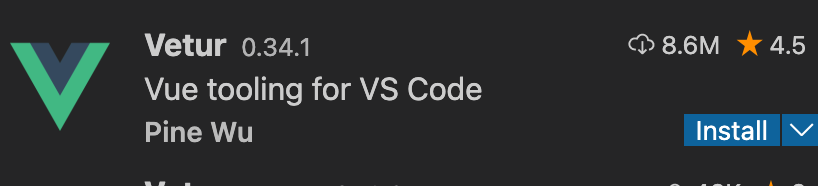
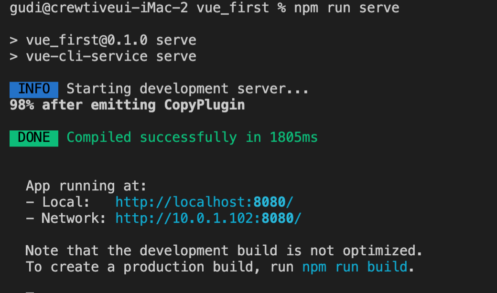
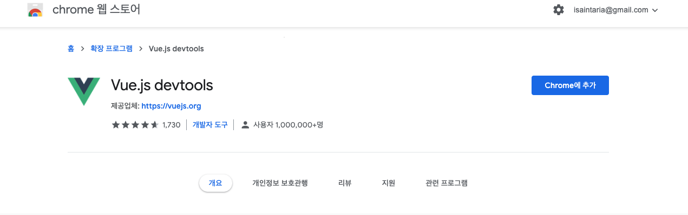
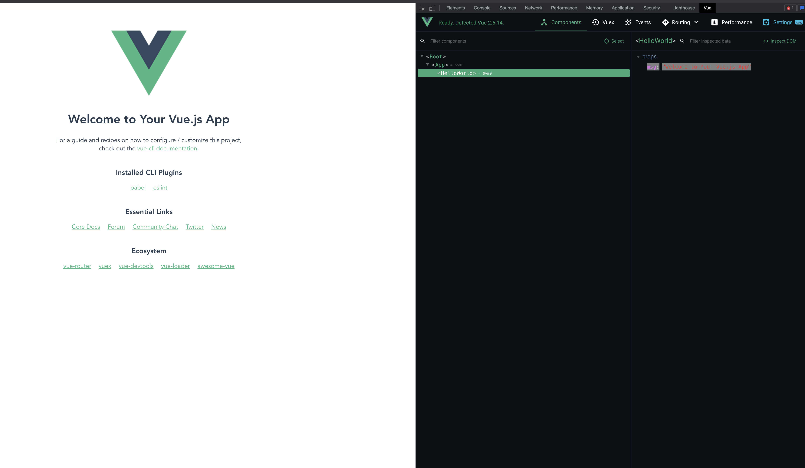

# vue_first

Vue cli 를 일단 설치
```shell
npm install -g @vue/cli
```

Vetur 설치

Vue 개발 하면서 가장 많이 쓰는 플러그인 이라고 함
- Syntax Highligh
- Code Formatting
등 여러가지 기능을 수행

```shell 
vue create [project name]
```
으로 vue 실행 하면 최초 페이지 생성

``` shell 
npm run serve
```



크롬에서 디버거를 설치해서 디버깅을 할 수 있음.



이렇게 보임




# 참고 사이트

공식 튜토리얼이 매우 잘되있는 편이라 이거 봐도 될 것 같음.
https://kr.vuejs.org/v2/guide/index.html
